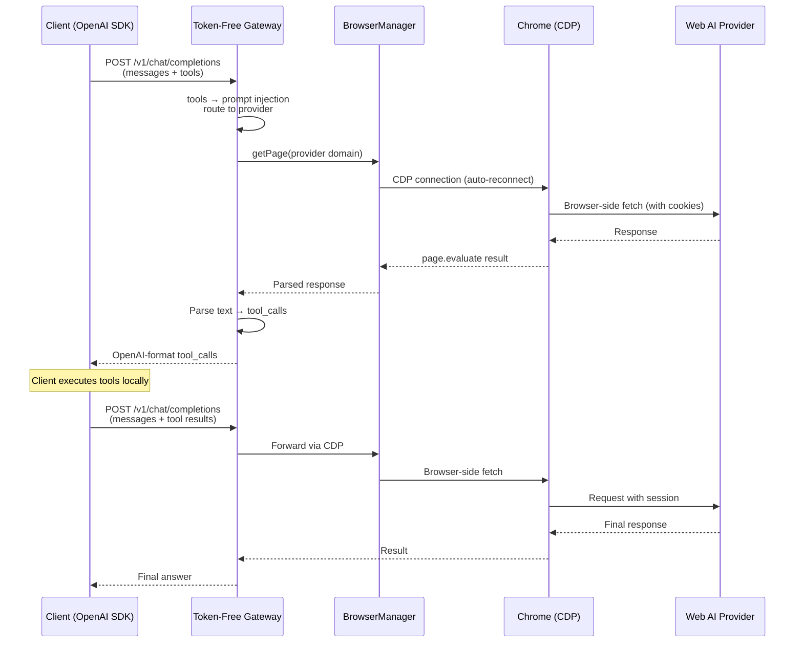

# Token-Free Gateway

**[中文文档](README_zh-CN.md)**

Use ChatGPT, Claude, Gemini, DeepSeek, and 9 more AI models — **completely free, no API keys required**. Just log in via browser.

Token-Free Gateway is a lightweight OpenAI-compatible API server that turns web-based AI sessions into a standard `/v1/chat/completions` endpoint with full **Tools / Function Calling** support. Point any OpenAI SDK client at it and it just works.

## Why Token-Free Gateway?

| Traditional API usage | Token-Free Gateway         |
| --------------------- | -------------------------- |
| Purchase API tokens   | **Completely free**        |
| Pay per request       | No quota, no billing       |
| Credit card required  | Browser login only         |
| API key may leak      | Credentials stored locally |

## What You Get

- **One endpoint, 13 providers** — Claude, ChatGPT, DeepSeek, Doubao, Gemini, GLM, GLM Intl, Grok, Kimi, Perplexity, Qwen, Qwen CN, Xiaomi MiMo
- **100% OpenAI-compatible** — `/v1/chat/completions`, `/v1/models`, streaming, tool_calls — zero client-side changes
- **Full Function Calling** — tools are injected as prompts, responses are parsed back into standard `tool_calls`
- **Cross-platform binary** — single executable for macOS, Linux, and Windows
- **Daemon mode** — `start` / `stop` / `restart` / `status` like a proper service

---

## Quick Start

### 1. Install

**Via npm** (recommended):

```bash
npm install -g token-free-gateway
# or run directly without installing:
npx token-free-gateway --help
```

> npm packages require `playwright-core` at runtime for browser-based providers: `npm i -g playwright-core`

**Prebuilt binary** — download from [GitHub Releases](../../releases):

```bash
tar xzf token-free-gateway-<platform>.tar.gz
chmod +x token-free-gateway
```

**From source:**

```bash
git clone https://github.com/andeya/token-free-gateway.git && cd token-free-gateway
bun install
bun run build    # → ./token-free-gateway
```

### 2. Authorize providers

Run the authorization wizard. Chrome will **start automatically** if it is not already running:

```bash
token-free-gateway webauth
```

Chrome opens with login pages for all 13 providers. Log in to the ones you want, then press **Enter** in the terminal. Select which providers to authorize — credentials are saved to `~/.token-free-gateway/auth-profiles.json`.

> **DeepSeek:** keep the DeepSeek chat page open while running `webauth` — the wizard captures the bearer token from the live session.
>
> **Tip:** if the terminal doesn't return after authorization, press **Ctrl+C** — credentials are already saved.
>
> **Manual Chrome control:** `chrome start` and `chrome stop` are also available as standalone commands if you need explicit control over the Chrome debug instance.

### 3. Start the gateway

```bash
token-free-gateway start      # background daemon (logs: ~/.token-free-gateway/gateway.log)
token-free-gateway serve      # foreground (for debugging)
```

The gateway listens on `http://localhost:3456`. Chrome is checked (and auto-started if needed) before the daemon launches.

### 4. Use it

```python
from openai import OpenAI

client = OpenAI(
    base_url="http://localhost:3456/v1",
    api_key="any-string",
)

response = client.chat.completions.create(
    model="claude-sonnet-4-20250514",
    messages=[{"role": "user", "content": "Hello!"}],
)
```

---

## Supported Providers

| Provider    | Model ID prefix | Auth Method           | Client                    |
| ----------- | --------------- | --------------------- | ------------------------- |
| Claude      | `claude-*`      | Session cookie        | CDP (browser fetch)       |
| ChatGPT     | `chatgpt-*`     | Access token + cookie | CDP (browser fetch)       |
| DeepSeek    | `deepseek-*`    | Bearer token + cookie | CDP (browser fetch + PoW) |
| Doubao      | `doubao-*`      | Session cookie        | CDP (browser fetch)       |
| Gemini      | `gemini-*`      | Google SID cookie     | CDP (browser fetch)       |
| GLM (智谱)  | `glm-*`         | Refresh token cookie  | CDP (browser fetch)       |
| GLM Intl    | `glm-intl-*`    | Session cookie        | CDP (browser fetch)       |
| Grok        | `grok-*`        | SSO cookie            | CDP (browser fetch)       |
| Kimi        | `kimi-*`        | Access token          | CDP (browser fetch)       |
| Perplexity  | `perplexity-*`  | Next-auth cookie      | CDP (browser fetch)       |
| Qwen        | `qwen-*`        | Session cookie        | CDP (browser fetch)       |
| Qwen CN     | `qwen-cn-*`     | XSRF + cookie         | CDP (browser fetch)       |
| Xiaomi MiMo | `xiaomimo-*`    | Bearer token          | CDP (browser fetch)       |

> All providers use a centralized `BrowserManager` that maintains a single shared CDP connection to Chrome with auto-reconnection and health monitoring. `playwright-core` is required at runtime: `npm i -g playwright-core`

---

## CLI Reference

```
token-free-gateway [command] [options]

Commands:
  serve               Start in foreground (default)
  start               Start as background daemon
  stop                Stop the daemon
  restart             Restart the daemon
  status              Show running status
  webauth             Authorize web AI providers
  chrome [start|stop] Launch/stop Chrome debug mode

Options:
  --help, -h          Show help
  --version, -v       Show version
```

---

## Configuration

Two ways to configure the gateway — pick whichever fits your workflow:

```
TFG_* environment variables  ← highest priority
        ↓ fall through if not set
~/.token-free-gateway/config.json
        ↓ fall through if not set
built-in defaults             ← lowest priority
```

### Option A — config file (recommended)

On **first start** the gateway automatically creates `~/.token-free-gateway/config.json` with all defaults filled in:

```json
{
  "port": 3456,
  "apiKey": "",
  "cdpUrl": "http://127.0.0.1:9222"
}
```

Edit the fields you want to change and leave the rest as-is.

| Field    | Default                 | Description                                   |
| -------- | ----------------------- | --------------------------------------------- |
| `port`   | `3456`                  | Server listen port                            |
| `apiKey` | `""` (disabled)         | Bearer token for client auth; empty = no auth |
| `cdpUrl` | `http://127.0.0.1:9222` | Chrome DevTools Protocol endpoint             |

### Option B — environment variables

All variables use the `TFG_` prefix to avoid conflicts with other software.

| Variable      | Default                 | Description                                   |
| ------------- | ----------------------- | --------------------------------------------- |
| `TFG_PORT`    | `3456`                  | Server listen port                            |
| `TFG_API_KEY` | `""` (disabled)         | Bearer token for client auth; empty = no auth |
| `TFG_CDP_URL` | `http://127.0.0.1:9222` | Chrome DevTools Protocol endpoint             |

You can also put them in a `.env` file next to the binary — Bun loads it automatically:

```bash
TFG_PORT=3456
TFG_API_KEY=my-secret-key
TFG_CDP_URL=http://127.0.0.1:9222
```

> **Note:** environment variables always win over `config.json`, so you can use the file for defaults and override individual values per-session with env vars.

---

## API Endpoints

| Method | Path                   | Auth     | Description                                  |
| ------ | ---------------------- | -------- | -------------------------------------------- |
| `POST` | `/v1/chat/completions` | Required | Chat completions (streaming + non-streaming) |
| `GET`  | `/v1/models`           | Required | List models from authorized providers        |
| `GET`  | `/v1/models/:id`       | Required | Get model details                            |
| `GET`  | `/health`              | Public   | Health check (includes browser CDP status)   |

> "Required" means the `Authorization: Bearer <TFG_API_KEY>` header is checked **only** when `TFG_API_KEY` is configured. If unset, all endpoints are open.

---

## How It Works



All API requests to web AI providers are executed **inside the browser** via Chrome DevTools Protocol (CDP), bypassing Cloudflare and other bot-protection systems. A centralized `BrowserManager` singleton manages the shared CDP connection with auto-reconnection, health monitoring, and Chrome auto-start.

---

## Platform Compatibility

| Feature                          | macOS | Linux | Windows                         |
| -------------------------------- | ----- | ----- | ------------------------------- |
| Gateway (`serve`/`start`/`stop`) | ✅    | ✅    | ✅                              |
| `chrome` command                 | ✅    | ✅    | ✅                              |
| `start-chrome-debug.sh`          | ✅    | ✅    | ✅ (use `chrome start` instead) |
| All providers                    | ✅    | ✅    | ✅                              |

---

## Dev Scripts

```bash
bun run dev         # Dev server with hot reload
bun run test        # Unit tests
bun run check       # Biome lint + format check
bun run lint:fix    # Auto-fix all issues
bun run typecheck   # TypeScript check
bun run build       # Compile standalone binary
bun run bump        # Show current version
bun run bump:patch  # Bump patch version (x.y.Z) and sync all package.json files
bun run bump:minor  # Bump minor version (x.Y.0) and sync all package.json files
bun run bump:major  # Bump major version (X.0.0) and sync all package.json files
```

---

## Troubleshooting

| Problem                         | Solution                                                                  |
| ------------------------------- | ------------------------------------------------------------------------- |
| `/v1/models` returns empty      | Run `token-free-gateway webauth` to authorize providers                   |
| `/health` returns `degraded`    | Chrome is not reachable — run `token-free-gateway chrome start`           |
| webauth hangs                   | Press **Ctrl+C** — credentials are saved                                  |
| Chrome auto-start fails         | Run `token-free-gateway chrome start` manually, then rerun `webauth`      |
| Chrome port 9222 already in use | Stop conflicting process: `lsof -i:9222` / `netstat -ano \| findstr 9222` |
| Playwright errors               | Install `playwright-core`: `npm i -g playwright-core`                     |
| DeepSeek auth fails             | Keep DeepSeek chat page open during `webauth`                             |
| Daemon not starting             | Check logs: `~/.token-free-gateway/gateway.log`                           |

---

## Acknowledgments

This project was distilled and redesigned from [openclaw-zero-token](https://github.com/linuxhsj/openclaw-zero-token), extracting the web AI provider layer and OpenAI compatibility module into a standalone, lightweight gateway focused purely on protocol conversion.

## License

MIT
