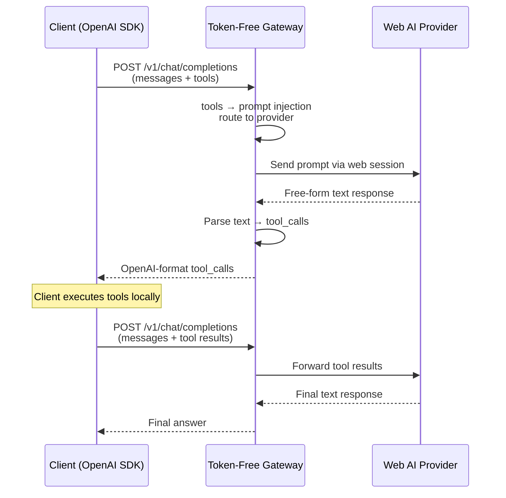

# Token-Free Gateway

[](https://github.com/owner/token-free-gateway/actions/workflows/ci.yml)

**[中文文档](README_zh-CN.md)**

Use ChatGPT, Claude, Gemini, DeepSeek, and 9 more AI models — **completely free, no API keys required**. Just log in via browser.

Token-Free Gateway is a lightweight OpenAI-compatible API server that turns web-based AI sessions into a standard `/v1/chat/completions` endpoint with full **Tools / Function Calling** support. Point any OpenAI SDK client at it and it just works.

## Why Token-Free Gateway?

| Traditional API usage | Token-Free Gateway         |
| --------------------- | -------------------------- |
| Purchase API tokens   | **Completely free**        |
| Pay per request       | No quota, no billing       |
| Credit card required  | Browser login only         |
| API key may leak      | Credentials stored locally |

## What You Get

- **One endpoint, 13 providers** — Claude, ChatGPT, DeepSeek, Doubao, Gemini, GLM, GLM Intl, Grok, Kimi, Perplexity, Qwen, Qwen CN, Xiaomi MiMo
- **100% OpenAI-compatible** — `/v1/chat/completions`, `/v1/models`, streaming, tool_calls — zero client-side changes
- **Full Function Calling** — tools are injected as prompts, responses are parsed back into standard `tool_calls`
- **Cross-platform binary** — single executable for macOS, Linux, and Windows
- **Daemon mode** — `start` / `stop` / `restart` / `status` like a proper service

---

## Quick Start

### 1. Install

**Prebuilt binary** (recommended) — download from [GitHub Releases](../../releases):

```bash
tar xzf token-free-gateway-<platform>.tar.gz
chmod +x token-free-gateway
```

**From source:**

```bash
git clone <repo-url> && cd token-free-gateway
bun install
bun run build    # → ./token-free-gateway
```

### 2. Launch Chrome debug mode

```bash
./token-free-gateway chrome
```

A dedicated Chrome instance opens with login pages for all 13 providers.

### 3. Log in & authorize

Log in to providers in the browser tabs, then run the wizard:

```bash
./token-free-gateway webauth
```

Select which providers to authorize. Credentials are saved to `~/.token-free-gateway/auth-profiles.json`.

> **DeepSeek:** keep the DeepSeek chat page open while running `webauth` — the wizard captures the bearer token from the live session.
>
> **Tip:** if the terminal doesn't return after authorization, press **Ctrl+C** — credentials are already saved.

### 4. Start the gateway

```bash
./token-free-gateway start      # background daemon
./token-free-gateway serve      # foreground (for debugging)
```

The gateway listens on `http://localhost:3456`.

### 5. Use it

```python
from openai import OpenAI

client = OpenAI(
    base_url="http://localhost:3456/v1",
    api_key="any-string",
)

response = client.chat.completions.create(
    model="claude-sonnet-4-20250514",
    messages=[{"role": "user", "content": "Hello!"}],
)
```

---

## Supported Providers

| Provider    | Model ID prefix | Auth Method           | Client         |
| ----------- | --------------- | --------------------- | -------------- |
| Claude      | `claude-*`      | Session cookie        | Fetch          |
| ChatGPT     | `chatgpt-*`     | Access token + cookie | Playwright CDP |
| DeepSeek    | `deepseek-*`    | Bearer token + cookie | Fetch (PoW)    |
| Doubao      | `doubao-*`      | Session cookie        | Fetch          |
| Gemini      | `gemini-*`      | Google SID cookie     | Playwright CDP |
| GLM (智谱)  | `glm-*`         | Refresh token cookie  | Playwright CDP |
| GLM Intl    | `glm-intl-*`    | Session cookie        | Playwright CDP |
| Grok        | `grok-*`        | SSO cookie            | Playwright CDP |
| Kimi        | `kimi-*`        | Access token          | Playwright CDP |
| Perplexity  | `perplexity-*`  | Next-auth cookie      | Playwright CDP |
| Qwen        | `qwen-*`        | Session cookie        | Playwright CDP |
| Qwen CN     | `qwen-cn-*`     | XSRF + cookie         | Playwright CDP |
| Xiaomi MiMo | `xiaomimo-*`    | Bearer token          | Fetch          |

> Playwright CDP providers require `playwright-core` at runtime: `npm i -g playwright-core`

---

## CLI Reference

```
token-free-gateway [command] [options]

Commands:
  serve               Start in foreground (default)
  start               Start as background daemon
  stop                Stop the daemon
  restart             Restart the daemon
  status              Show running status
  webauth             Authorize web AI providers
  chrome [start|stop] Launch/stop Chrome debug mode

Options:
  --help, -h          Show help
  --version, -v       Show version
```

---

## Configuration

| Variable          | Default                 | Description                                   |
| ----------------- | ----------------------- | --------------------------------------------- |
| `PORT`            | `3456`                  | Server port                                   |
| `GATEWAY_API_KEY` | _(empty)_               | Bearer token for client auth; empty = no auth |
| `CDP_URL`         | `http://127.0.0.1:9222` | Chrome DevTools Protocol endpoint             |

Create a `.env` file next to the binary:

```bash
PORT=3456
GATEWAY_API_KEY=my-secret-key
```

---

## API Endpoints

| Method | Path                   | Description                                  |
| ------ | ---------------------- | -------------------------------------------- |
| `POST` | `/v1/chat/completions` | Chat completions (streaming + non-streaming) |
| `GET`  | `/v1/models`           | List models from authorized providers        |
| `GET`  | `/v1/models/:id`       | Get model details                            |
| `GET`  | `/health`              | Health check                                 |

---

## How It Works



The gateway converts OpenAI's structured `tools` definitions into prompt-injected instructions, sends them to the web AI, and parses the free-form text response back into standard `tool_calls`. The client never knows it's not talking to OpenAI.

---

## Platform Compatibility

| Feature                          | macOS | Linux | Windows         |
| -------------------------------- | ----- | ----- | --------------- |
| Gateway (`serve`/`start`/`stop`) | ✅    | ✅    | ✅              |
| `chrome` command                 | ✅    | ✅    | ✅              |
| `start-chrome-debug.sh`          | ✅    | ✅    | ⚠️ WSL/Git Bash |
| All providers                    | ✅    | ✅    | ✅              |

---

## Dev Scripts

```bash
bun run dev         # Dev server with hot reload
bun run test        # Unit tests
bun run check       # Biome lint + format check
bun run lint:fix    # Auto-fix all issues
bun run typecheck   # TypeScript check
bun run build       # Compile standalone binary
```

---

## Troubleshooting

| Problem                    | Solution                                                         |
| -------------------------- | ---------------------------------------------------------------- |
| `/v1/models` returns empty | Run `token-free-gateway webauth` to authorize providers          |
| webauth hangs              | Press **Ctrl+C** — credentials are saved                         |
| Chrome won't start         | Check port 9222: `lsof -i:9222` / `netstat -ano \| findstr 9222` |
| Playwright errors          | Install `playwright-core`: `npm i -g playwright-core`            |
| DeepSeek auth fails        | Keep DeepSeek chat page open during `webauth`                    |

---

## Acknowledgments

This project was distilled and redesigned from [openclaw-zero-token](https://github.com/linuxhsj/openclaw-zero-token), extracting the web AI provider layer and OpenAI compatibility module into a standalone, lightweight gateway focused purely on protocol conversion.

## License

MIT
