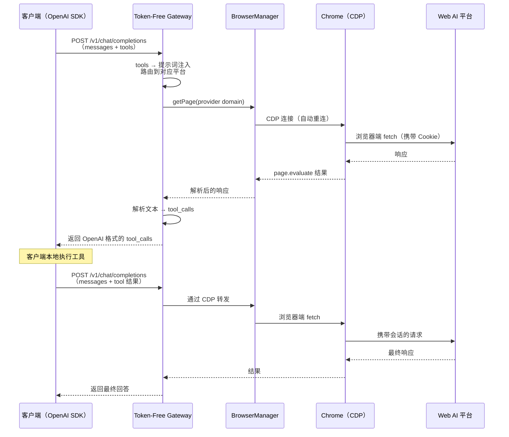

# Token-Free Gateway

**[English](README.md)**

免费使用 ChatGPT、Claude、Gemini、DeepSeek 等 13 个主流 AI 模型 —— **无需 API Key，只需浏览器登录**。

Token-Free Gateway 是一个轻量级 OpenAI 兼容 API 网关，将网页端 AI 会话转化为标准的 `/v1/chat/completions` 接口，完整支持 **Tools / Function Calling** 协议。任何 OpenAI SDK 客户端均可直接接入，无需任何修改。

## 为什么选择 Token-Free Gateway？

| 传统 API 用法    | Token-Free Gateway |
| ---------------- | ------------------ |
| 购买 API Token   | **完全免费**       |
| 按请求付费       | 无配额、无账单     |
| 需要绑定信用卡   | 仅需浏览器登录     |
| API Key 可能泄露 | 凭证仅存储在本地   |

## 核心特性

- **一个接口，13 个平台** — Claude、ChatGPT、DeepSeek、豆包、Gemini、智谱 GLM、GLM 国际版、Grok、Kimi、Perplexity、千问国际版、千问国内版、小米 MiMo
- **100% OpenAI 兼容** — `/v1/chat/completions`、`/v1/models`、流式输出、`tool_calls` —— 客户端零改造
- **完整 Function Calling** — 将 tools 定义注入提示词，解析模型回复为标准 `tool_calls` 格式
- **跨平台二进制** — macOS、Linux、Windows 单文件可执行
- **守护进程模式** — `start` / `stop` / `restart` / `status`，像正规服务一样管理

---

## 快速开始

### 1. 安装

**通过 npm**（推荐）：

```bash
npm install -g token-free-gateway
# 或免安装直接运行：
npx token-free-gateway --help
```

> npm 包在运行时需要 `playwright-core` 支持浏览器类 provider：`npm i -g playwright-core`

**下载预编译二进制** —— 从 [GitHub Releases](../../releases) 获取：

```bash
tar xzf token-free-gateway-<platform>.tar.gz
chmod +x token-free-gateway
```

**从源码构建：**

```bash
git clone https://github.com/andeya/token-free-gateway.git && cd token-free-gateway
bun install
bun run build    # → ./token-free-gateway
```

### 2. 授权平台

运行授权向导，若 Chrome 尚未以调试模式运行，**将自动启动**：

```bash
token-free-gateway webauth
```

Chrome 会打开所有 13 个平台的登录页面。在浏览器中完成登录后，在终端按 **Enter** 继续，然后选择要授权的平台 —— 凭证保存在 `~/.token-free-gateway/auth-profiles.json`。

> **DeepSeek 特殊说明：** 运行 `webauth` 时需要保持 DeepSeek 聊天页面处于打开状态，向导会自动抓取 bearer token。
>
> **提示：** 授权完成后如果终端未返回提示符，按 **Ctrl+C** 即可 —— 凭证已保存。
>
> **手动控制 Chrome：** 也可单独使用 `chrome start` / `chrome stop` 命令显式管理 Chrome 调试实例。

### 3. 启动网关

```bash
token-free-gateway start      # 后台守护进程（日志：~/.token-free-gateway/gateway.log）
token-free-gateway serve      # 前台运行（调试用）
```

网关默认监听 `http://localhost:3456`。守护进程启动前会自动检查 Chrome 是否就绪，未就绪时会自动启动。

### 4. 接入使用

```python
from openai import OpenAI

client = OpenAI(
    base_url="http://localhost:3456/v1",
    api_key="any-string",
)

response = client.chat.completions.create(
    model="claude-sonnet-4-20250514",
    messages=[{"role": "user", "content": "你好！"}],
)
```

---

## 支持的平台

| 平台       | 模型 ID 前缀   | 认证方式              | 客户端类型                |
| ---------- | -------------- | --------------------- | ------------------------- |
| Claude     | `claude-*`     | Session cookie        | CDP（浏览器 fetch）       |
| ChatGPT    | `chatgpt-*`    | Access token + cookie | CDP（浏览器 fetch）       |
| DeepSeek   | `deepseek-*`   | Bearer token + cookie | CDP（浏览器 fetch + PoW） |
| 豆包       | `doubao-*`     | Session cookie        | CDP（浏览器 fetch）       |
| Gemini     | `gemini-*`     | Google SID cookie     | CDP（浏览器 fetch）       |
| 智谱 GLM   | `glm-*`        | Refresh token cookie  | CDP（浏览器 fetch）       |
| GLM 国际版 | `glm-intl-*`   | Session cookie        | CDP（浏览器 fetch）       |
| Grok       | `grok-*`       | SSO cookie            | CDP（浏览器 fetch）       |
| Kimi       | `kimi-*`       | Access token          | CDP（浏览器 fetch）       |
| Perplexity | `perplexity-*` | Next-auth cookie      | CDP（浏览器 fetch）       |
| 千问国际版 | `qwen-*`       | Session cookie        | CDP（浏览器 fetch）       |
| 千问国内版 | `qwen-cn-*`    | XSRF + cookie         | CDP（浏览器 fetch）       |
| 小米 MiMo  | `xiaomimo-*`   | Bearer token          | CDP（浏览器 fetch）       |

> 所有 provider 均通过统一的 `BrowserManager` 管理，共享一个 CDP 连接到 Chrome，支持自动重连和健康监控。运行时依赖 `playwright-core`：`npm i -g playwright-core`

---

## CLI 命令参考

```
token-free-gateway [command] [options]

命令：
  serve               前台启动（默认）
  start               后台守护进程启动
  stop                停止守护进程
  restart             重启守护进程
  status              查看运行状态
  webauth             授权 Web AI 平台
  chrome [start|stop] 启动/停止 Chrome 调试模式

选项：
  --help, -h          显示帮助
  --version, -v       显示版本号
```

---

## 配置

| 环境变量          | 默认值                  | 说明                                    |
| ----------------- | ----------------------- | --------------------------------------- |
| `PORT`            | `3456`                  | 监听端口                                |
| `GATEWAY_API_KEY` | _（空）_                | 客户端鉴权 Bearer Token；为空则关闭鉴权 |
| `CDP_URL`         | `http://127.0.0.1:9222` | Chrome 远程调试协议地址                 |

在二进制同目录创建 `.env` 文件：

```bash
PORT=3456
GATEWAY_API_KEY=my-secret-key
```

---

## API 端点

| 方法   | 路径                   | 说明                          |
| ------ | ---------------------- | ----------------------------- |
| `POST` | `/v1/chat/completions` | 对话补全（支持流式与非流式）  |
| `GET`  | `/v1/models`           | 列出已授权平台的模型          |
| `GET`  | `/v1/models/:id`       | 查询模型详情                  |
| `GET`  | `/health`              | 健康检查（含浏览器 CDP 状态） |

---

## 工作原理



所有对 Web AI 平台的 API 请求均在**浏览器内部**通过 Chrome DevTools Protocol（CDP）执行，绕过 Cloudflare 等反爬保护。统一的 `BrowserManager` 单例管理共享的 CDP 连接，支持自动重连、健康监控和 Chrome 自动启动。

---

## 平台兼容性

| 功能                           | macOS | Linux | Windows                     |
| ------------------------------ | ----- | ----- | --------------------------- |
| 网关（`serve`/`start`/`stop`） | ✅    | ✅    | ✅                          |
| `chrome` 命令                  | ✅    | ✅    | ✅                          |
| `start-chrome-debug.sh`        | ✅    | ✅    | ✅（推荐用 `chrome start`） |
| 全部 provider                  | ✅    | ✅    | ✅                          |

---

## 开发脚本

```bash
bun run dev         # 开发模式（热重载）
bun run test        # 单元测试
bun run check       # Biome lint + 格式检查
bun run lint:fix    # 自动修复所有问题
bun run typecheck   # TypeScript 类型检查
bun run build       # 编译独立二进制
bun run bump        # 显示当前版本号
bun run bump:patch  # 升级补丁版本（x.y.Z），同步所有 package.json
bun run bump:minor  # 升级次版本（x.Y.0），同步所有 package.json
bun run bump:major  # 升级主版本（X.0.0），同步所有 package.json
```

---

## 常见问题

| 问题                      | 解决方案                                                         |
| ------------------------- | ---------------------------------------------------------------- |
| `/v1/models` 返回空列表   | 执行 `token-free-gateway webauth` 授权平台                       |
| `/health` 返回 `degraded` | Chrome 不可达，执行 `token-free-gateway chrome start`            |
| webauth 卡住              | 按 **Ctrl+C** —— 凭证已保存                                      |
| Chrome 自动启动失败       | 手动执行 `token-free-gateway chrome start`，再重新运行 `webauth` |
| 9222 端口被占用           | 检查冲突进程：`lsof -i:9222`                                     |
| Playwright 报错           | 安装 `playwright-core`：`npm i -g playwright-core`               |
| DeepSeek 认证失败         | 运行 webauth 时保持 DeepSeek 页面打开                            |
| 守护进程启动失败          | 查看日志：`~/.token-free-gateway/gateway.log`                    |

---

## 致谢

本项目从 [openclaw-zero-token](https://github.com/linuxhsj/openclaw-zero-token) 抽离并重新设计，提取其 Web AI provider 层和 OpenAI 兼容模块，构建为一个专注于协议转换的独立轻量网关。

## License

MIT
